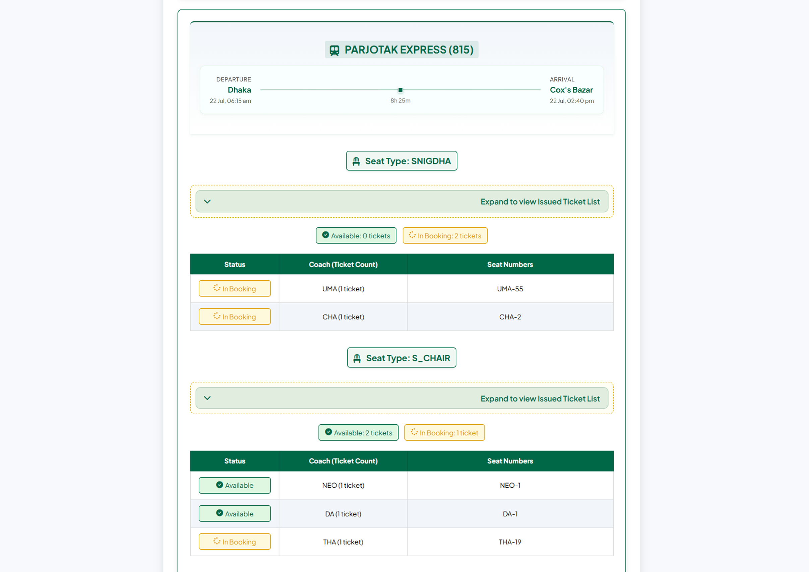

# 🚆 Bangladesh Railway Train Seat Availability Web Application

A comprehensive web application to **check real-time seat availability** for Bangladesh Railway trains. This application provides **detailed seat information, coach-wise breakdown, and intelligent request management** — built using Flask + Vanilla JS + REST APIs.

> 📱 **Android App Available**: To minimize web traffic and provide better performance, an **Android app version** is now available! Check the [**GitHub Releases**](https://github.com/nishatrhythm/Train-Seat-App-Releases/blob/main/README.md) for latest updates, new features, and download links.

✨ **Key Features:**
- 🎯 **Real-Time Seat Checking**: Live seat availability for all Bangladesh Railway trains
- 🚂 **Detailed Coach Layout**: View available seats by coach and seat type
- 📊 **Multiple Seat Classes**: Support for all seat types (S_CHAIR, SNIGDHA, AC_B, etc.)
- 🎫 **Ticket Type Analysis**: Shows issued, soon-to-be-issued, and reserved tickets
- ⏳ **Smart Queue System**: Intelligent request management to prevent API overload
- 🔄 **Authentication Management**: Automated token handling and refresh
- 📱 **Mobile-Optimized Interface**: Fully responsive design for all devices
- 🛡️ **Error Handling**: Graceful handling of API failures and rate limits
- 🔗 **Direct Booking**: Integration with official Bangladesh Railway booking system

---

## 🌐 Live Site

👉 **Live URL:** [trainseat.onrender.com](https://trainseat.onrender.com)  
⚠️ **Note:** First load may be delayed up to 1 minute due to free-tier cold starts.

<br>

|  |  |  |
|--------------------------------------------------|--------------------------------------------------|--------------------------------------------------|
| <div align="center">**Home Interface**</div>     | <div align="center">**Seat Availability Page**</div>   | <div align="center">**Seat Availability Result**</div> |

---

<div align="center">
  <a href="https://youtu.be/zG55QW73N0c">
    
  </a>
</div>

> **Video Guide:** You can run this entire project on your own computer. Detailed video instructions are available in [the YouTube video above](https://youtu.be/zG55QW73N0c).

---

## 📚 Table of Contents

1. [Project Structure](#-project-structure)  
2. [Features Overview](#️-features-overview)  
3. [Core Logic](#-core-logic)  
4. [Seat Analysis Algorithm](#-seat-analysis-algorithm)  
5. [Frontend Features](#️-frontend-features)  
6. [Queue Management](#-queue-management)  
7. [API Integration](#-api-integration)  
8. [Cache Control](#-cache-control)  
9. [Authentication System](#-authentication-system)  
10. [Technologies Used](#-technologies-used)  
11. [Setup Instructions](#-setup-instructions)  
12. [Configuration](#️-configuration)  
13. [License](#-license)

---

## 📂 Project Structure
```
.
├── app.py                        # Flask backend with routes, session mgmt & rendering
├── config.json                   # Dynamic config: maintenance, queue settings, app version
├── detailsSeatAvailability.py    # Core seat availability logic, API calls, seat analysis
├── request_queue.py              # Advanced queue system for managing concurrent requests
├── stations_en.json              # Complete list of Bangladesh Railway stations
├── trains_en.json                # Complete list of 120+ Bangladesh Railway trains
├── .env                          # Environment variables (not in repo - create locally)
├── LICENSE                       # Project license
├── Procfile                      # Heroku/Render deployment configuration
├── README.md                     # Project documentation (this file)
├── requirements.txt              # Python dependencies
├── images/
│   ├── link_share_image.png      # Social sharing preview image
│   ├── Screenshot_1.png          # Interface screenshots
│   └── Screenshot_2.png          # Results view screenshots
├── static/
│   ├── css/
│   │   └── styles.css            # Responsive UI with seat visualizations
│   ├── images/
│   │   └── sample_banner.png     # Default banner image
│   └── js/
│       └── script.js             # Frontend logic, validations, dropdowns
└── templates/
    ├── 404.html                  # Custom error page with auto-redirect
    ├── admin.html                # Android restriction bypass page for admin
    ├── android.html              # Android device redirection page
    ├── index.html                # Home form with station selection
    ├── results.html              # Seat availability display with coach breakdown
    ├── notice.html               # Maintenance mode page
    └── queue.html                # Queue status tracking page
```

---

## ⚙️ Features Overview

| Feature                                  | Status ✅ | Description |
|------------------------------------------|-----------|-------------|
| Real-Time Seat Availability             | ✅        | Live data from Bangladesh Railway systems |
| Coach-wise Seat Breakdown              | ✅        | Detailed view of available seats by coach |
| Multiple Seat Class Support            | ✅        | All Bangladesh Railway seat types supported |
| Ticket Type Classification             | ✅        | Issued, soon-to-be-issued, reserved tickets |
| Smart Authentication System            | ✅        | Automated token management and refresh |
| Advanced Queue Management              | ✅        | Prevents API overload with intelligent queuing |
| Responsive Design                      | ✅        | Mobile-optimized interface |
| Direct Booking Integration             | ✅        | Links to official booking system |
| Error Recovery                         | ✅        | Graceful handling of API failures |
| Maintenance Mode Support               | ✅        | Configurable site-wide notices |
| Session-based Form State              | ✅        | Preserves user input across requests |
| Custom Error Handling                 | ✅        | User-friendly error messages |
| Social Media Integration              | ✅        | Open Graph tags for sharing |
| Cache-Control Headers                 | ✅        | Ensures fresh data on every request |
| User Activity Logging                 | ✅        | Comprehensive logging of user interactions and system events |
| JWT Authentication System             | ✅        | Automated Bearer token management and refresh |
| **Android Device Detection**          | ✅        | **Smart traffic management with automatic app redirection** |
| **Admin Access Control**              | ✅        | **Secure administrative interface with environment-based auth** |

---

## 🧠 Core Logic

### 🚂 Seat Availability Engine

The heart of the application lies in `detailsSeatAvailability.py`, which implements:

```python
def main(config: Dict) -> Dict
```

**Process Flow:**
1. **Train Search**: Fetches trains for specified route and date
2. **Seat Layout Retrieval**: Gets detailed seat layout for each train
3. **Seat Analysis**: Categorizes seats by availability and type
4. **Coach Organization**: Groups seats by coach using Bengali naming convention
5. **Result Aggregation**: Combines all data for frontend display

### 🔄 Authentication Management

Intelligent token handling system:

```python
def fetch_token() -> str
def set_token(token: str)
```

**Features:**
- Automatic token refresh on expiration
- Retry logic for failed authentication
- Secure credential management via environment variables
- Error handling for invalid credentials

### 📊 Seat Type Processing

Supports all Bangladesh Railway seat classes with detailed analysis:
- **Available Seats**: Ready for booking
- **Booking Process Seats**: Currently being processed
- **Issued Tickets**: Tickets available for purchase
- **Soon-to-be-Issued**: Tickets becoming available soon
- **Reserved Tickets**: Not available for public booking

---

## 🧮 Seat Analysis Algorithm

### Coach Ordering System
```python
BANGLA_COACH_ORDER = [
    "KA", "KHA", "GA", "GHA", "UMA", "CHA", "SCHA", "JA", "JHA", "NEO",
    "TA", "THA", "DA", "DHA", "TO", "THO", "DOA", "DANT", "XTR1", "XTR2", "XTR3", "XTR4", "XTR5", "SLR", "STD"
]
```

### Seat Layout Analysis
```python
def analyze_seat_layout(data: Dict) -> Dict
```

**Processing Steps:**
1. **Layout Parsing**: Extracts seat information from API response
2. **Categorization**: Groups seats by ticket type (1-4)
3. **Sorting**: Orders seats using custom coach ordering system
4. **Counting**: Provides totals for each category

### Smart Seat Sorting
```python
def sort_seat_number(seat: str) -> tuple
```

**Features:**
- Bengali coach name recognition
- Numerical seat ordering
- Fallback handling for unknown formats
- Consistent display across all trains

---

## 🎨 Frontend Features

### 1. Intelligent Station Selection
- **Autocomplete Dropdown**: Real-time search through 500+ stations
- **Caching System**: Stores station data locally for performance
- **Validation**: Ensures valid station selection before submission
- **User Experience**: Smooth, responsive interface

### 2. Results Visualization
- **Coach-wise Display**: Organized seat layout by coach
- **Color Coding**: Visual indicators for different seat types
- **Responsive Tables**: Horizontal scroll on mobile devices
- **Ticket Purchase Links**: Direct integration with official booking

### 3. Mobile Optimization
- **Touch-friendly Controls**: Large tap targets for mobile interaction
- **Adaptive Layout**: Single-column layout on small screens
- **Fast Loading**: Optimized assets and progressive enhancement
- **Offline Support**: Graceful degradation when network is unavailable

### 4. Interactive Elements
```javascript
// Dynamic station loading and caching
function loadStations()
// Form validation and submission
function validateForm()
```

---

## ⏳ Queue Management

### Advanced Request Queue (`request_queue.py`)

**Features:**
- **Concurrent Limiting**: Configurable max concurrent requests
- **Cooldown Periods**: Prevents API flooding
- **Request Prioritization**: FIFO with abandonment detection
- **Health Monitoring**: Tracks processing times and success rates
- **Auto-cleanup**: Removes stale requests and results

**Configuration:**
```json
{
    "queue_max_concurrent": 1,
    "queue_cooldown_period": 3,
    "queue_batch_cleanup_threshold": 10,
    "queue_cleanup_interval": 30,
    "queue_heartbeat_timeout": 60
}
```

**Process Flow:**
1. Request submitted → Added to queue
2. Queue position displayed to user
3. Request processed when slot available
4. Results cached and delivered
5. Automatic cleanup of completed requests

---

## 🔌 API Integration

### Bangladesh Railway API Endpoints

#### 1. Authentication
```http
POST https://railspaapi.shohoz.com/v1.0/app/auth/sign-in
Content-Type: application/json
{
    "mobile_number": "MOBILE_NUMBER",
    "password": "PASSWORD"
}
```

#### 2. Train Search
```http
GET https://railspaapi.shohoz.com/v1.0/app/bookings/search-trips-v2
Params: from_city, to_city, date_of_journey, seat_class
```

#### 3. Seat Layout
```http
GET https://railspaapi.shohoz.com/v1.0/app/bookings/seat-layout
Params: trip_id, trip_route_id
Headers: Authorization: Bearer {token}
```

### Error Handling
- **Network Timeouts**: 30-second request timeout
- **Rate Limiting**: Built-in cooldown mechanisms
- **Authentication Refresh**: Automatic token renewal
- **Retry Logic**: Automatic retries for transient failures
- **User-friendly Messages**: Clear error communication

---

## � Cache Control

All responses include strict cache headers:
```http
Cache-Control: no-store, no-cache, must-revalidate, max-age=0
Pragma: no-cache
Expires: 0
```

**Benefits:**
- Always fresh data from APIs
- No stale seat availability information
- Proper handling of dynamic content
- Prevents browser caching issues

---

## �🔐 Authentication System

### Secure Credential Management
```python
# Environment-based configuration
mobile_number = os.getenv("FIXED_MOBILE_NUMBER")
password = os.getenv("FIXED_PASSWORD")
```

### Token Lifecycle Management
- **Automatic Refresh**: Detects expired tokens and refreshes
- **Session Persistence**: Maintains authentication across requests
- **Error Recovery**: Handles invalid credentials gracefully
- **Security**: No hardcoded credentials in source code

### Rate Limit Handling
- **403 Error Detection**: Identifies rate limit responses
- **Backoff Strategy**: Implements exponential backoff
- **User Notification**: Clear messaging about rate limits

---

## 🧰 Technologies Used

### Backend
- **Python 3.10+**
- **Flask 3.1.0** - Web framework
- **requests 2.32.3** - HTTP client for API calls
- **pytz 2024.2** - Timezone handling
- **colorama 0.4.6** - Terminal color output
- **python-dotenv 1.0.1** - Environment variable management
- **gunicorn 23.0.0** - WSGI server for production deployment
- **Structured Logging** - INFO level logging with timestamp and user activity tracking

### Frontend
- **HTML5** with semantic markup
- **CSS3** with Flexbox and Grid
- **Vanilla JavaScript** - No external dependencies
- **Font Awesome 6.7.2** - Icon library
- **Responsive Design** - Mobile-first approach

### Data Processing
- **JSON Processing** - Native Python JSON handling
- **Date/Time Handling** - pytz for timezone awareness
- **Seat Sorting Algorithms** - Custom Bengali coach ordering
- **Authentication Management** - Token-based API access

---

## 🧪 Setup Instructions

### 1. Clone Repository
```bash
git clone https://github.com/nishatrhythm/Bangladesh-Railway-Train-Seat-Availability-Web-Application.git
cd Bangladesh-Railway-Train-Seat-Availability-Web-Application
```

### 2. Install Dependencies
```bash
pip install -r requirements.txt
```

### 3. Configure Environment Variables
Create a `.env` file or set environment variables:
```bash
FIXED_MOBILE_NUMBER=your_mobile_number
FIXED_PASSWORD=your_password
```

### 4. Configure Application
Edit `config.json` for customization:
```json
{
    "version": "1.1.0",
    "is_maintenance": 0,
    "queue_max_concurrent": 1,
    "queue_cooldown_period": 3,
    "queue_enabled": true
}
```

### 5. Run Application
```bash
python app.py
```

**Production Deployment:**
```bash
# With Gunicorn (recommended for production)
gunicorn app:app --log-level=info --access-logfile=-
```

**Logging Output:**
The application will display structured logs including:
- Timestamp and log level
- User submissions with device/browser information
- API request details and response status
- Queue management and processing events
- Error tracking and system health monitoring

### 6. Access Application
Visit `http://localhost:5000` in your browser

---

## ⚙️ Configuration

### Environment Configuration
Environment variables for Bangladesh Railway API access and admin functionality:
```bash
# Bangladesh Railway API Credentials
FIXED_MOBILE_NUMBER=your_mobile_number  # Required for JWT token authentication
FIXED_PASSWORD=your_password            # Required for JWT token authentication

# Admin Access Control
ADMIN_ACCESS_CODE=your_admin_code       # Optional - Enables Android restriction bypass
```

**Security Notes:**
- Never commit credentials to version control
- Use environment variables or secure secret management
- Credentials are loaded from `/etc/secrets/.env` in production environments
- Admin access code enables administrative features and Android bypass functionality

### Queue Settings
- **max_concurrent**: Number of simultaneous API requests (default: 1)
- **cooldown_period**: Delay between requests in seconds (default: 3)
- **batch_cleanup_threshold**: Trigger cleanup after N completed requests
- **cleanup_interval**: Background cleanup frequency in seconds
- **heartbeat_timeout**: Request timeout in seconds

### Maintenance Mode
```json
{
    "is_maintenance": 1,
    "maintenance_message": "Site is under maintenance..."
}
```

### Banner System
```json
{
    "is_banner_enabled": 1,
    "image_link": "https://example.com/banner.png",
    "force_banner": 0
}
```

---

## 🔧 API Response Format

### Seat Availability Data Structure
```json
{
    "TRAIN_NUMBER": {
        "departure_time": "2025-05-26T06:00:00",
        "arrival_time": "2025-05-26T12:30:00",
        "seat_data": [
            {
                "type": "S_CHAIR",
                "available_count": 45,
                "booking_process_count": 3,
                "available_seats": ["KA-1", "KA-2", "KHA-1"],
                "booking_process_seats": ["KA-3"],
                "is_422": false,
                "ticket_types": {
                    "1": {
                        "label": "Issued Tickets to Buy",
                        "seats": ["KA-1", "KA-2"],
                        "count": 2
                    }
                }
            }
        ]
    }
}
```

### User Activity Logging

The application implements comprehensive logging to track user interactions and system performance:

**Logging Configuration:**
```python
logging.basicConfig(
    level=logging.INFO,
    format='%(asctime)s - %(levelname)s - %(message)s',
    handlers=[logging.StreamHandler(sys.stdout)]
)
```

**Logged Events:**
- **Seat Availability Requests**: `Seat Availability Request - Origin: 'ORIGIN_STATION', Destination: 'DESTINATION_STATION', Date: 'DATE', Device: 'DEVICE_TYPE', Browser: 'BROWSER'`
- **System Events**: Queue status, API failures, and error handling
- **Production Logs**: Gunicorn access logs with `--log-level=info --access-logfile=-`

**Device & Browser Detection:**
- Automatically detects user device type (Mobile/PC)
- Identifies browser (Chrome, Firefox, Safari, Edge, Opera, IE)
- Logs user agent information for analytics and debugging

---

## 🛡️ Security Features

- **Environment Variables**: Secure credential storage
- **Input Sanitization**: All form inputs validated server-side
- **Session Management**: Secure session handling with Flask
- **XSS Protection**: Proper template escaping
- **Rate Limiting**: Queue system prevents API abuse
- **Authentication**: Secure token-based API access

---

## 📱 Mobile Features

- **Responsive Design**: Works seamlessly on all screen sizes
- **Touch Optimization**: Large clickable areas for mobile
- **Fast Loading**: Optimized assets and progressive enhancement
- **Offline Handling**: Graceful degradation when network unavailable
- **Native Feel**: App-like experience on mobile browsers

---

## 🎯 Future Enhancements

- [ ] Multi-language support (Bengali/English)
- [ ] API caching layer for improved performance

---

## 📱 App Updates & News

For the latest updates, new features, and Android app releases, visit our **GitHub Releases**:

👉 **[Updates & Downloads](https://github.com/nishatrhythm/Train-Seat-App-Releases/blob/main/README.md)** - Stay updated with new features and app versions

---

## 🤝 Contributing

1. Fork the repository
2. Create a feature branch (`git checkout -b feature/amazing-feature`)
3. Commit your changes (`git commit -m 'Add amazing feature'`)
4. Push to the branch (`git push origin feature/amazing-feature`)
5. Open a Pull Request

---

## ⚖️ Disclaimer

This application uses **publicly accessible APIs** provided by Bangladesh Railway's official e-ticketing platform. All data is fetched through legitimate REST endpoints without any reverse engineering or unauthorized access.

- **Educational Purpose**: Designed for learning and informational use
- **API Compliance**: Respects rate limits and terms of service
- **No Data Scraping**: Uses official API endpoints only
- **Privacy Focused**: Minimal user data collection

If requested by the official service provider, access will be adjusted accordingly.

---

## 📄 License

This project is licensed under the MIT License - see the [LICENSE](LICENSE) file for details.

---

## 🙏 Acknowledgments

- **Bangladesh Railway** for providing public API access
- **Shohoz** for the e-ticketing platform integration
- **Open Source Community** for inspiration and tools
- **Contributors** who help improve this project

---

<div align="center">

**Made with ❤️ for Bangladesh Railway passengers**

[🌐 Live Demo](https://trainseat.onrender.com) | [📱 Android App](https://github.com/nishatrhythm/Train-Seat-App-Releases/blob/main/README.md) | [📧 Feedback](https://forms.gle/NV72PC1z75sq77tg7) | [⭐ Star on GitHub](https://github.com/nishatrhythm/Bangladesh-Railway-Train-Seat-Availability-Web-Application)

</div>
