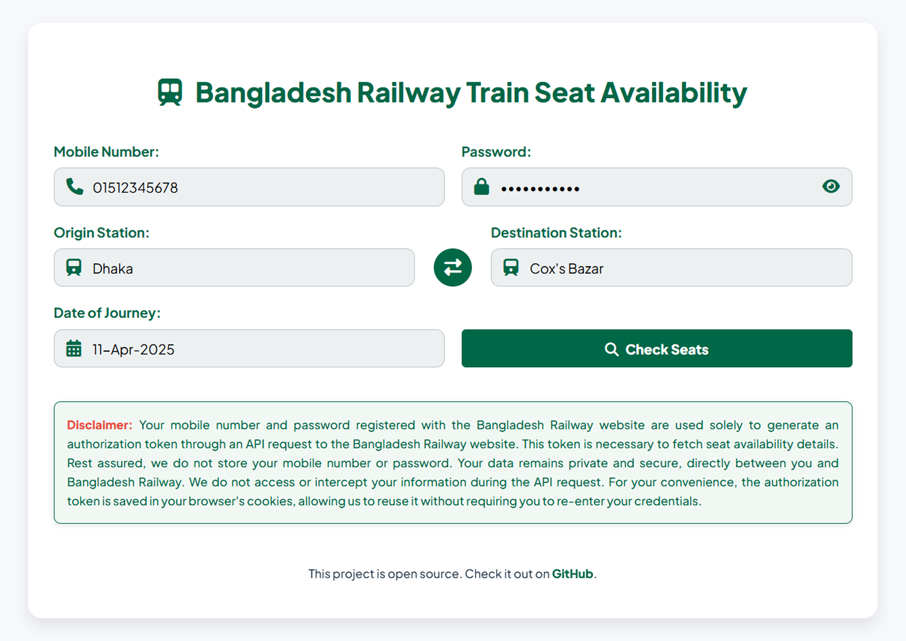
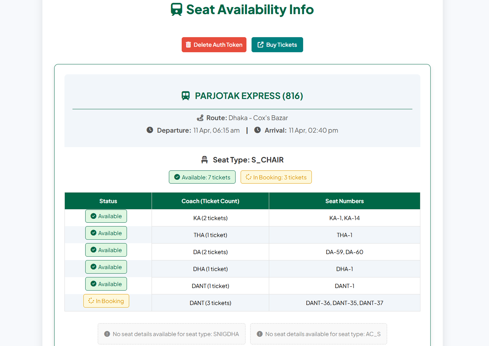

# 🚆 Bangladesh Railway Train Seat Availability Web Application

A full-stack web application to **securely fetch and visualize real-time train seat availability** from the official Bangladesh Railway e-ticketing API. This version focuses on **efficiency, user experience, and serverless operation** — fully aligned with official data, built using Flask + Vanilla JS + REST APIs.

✨ **Key Features:**
- 🔍 **Real-time Seat Availability**: Check available seats across all trains between stations
- 🧮 **Visual Coach Layout**: See seats grouped by coach with clear status indicators
- 🗓️ **Next 10 Days Availability**: Plan trips with date-specific seat information
- 🚄 **All Bangladesh Railway Routes**: Complete coverage of official train routes
- 📱 **Mobile-Optimized Interface**: Fully responsive design for all devices
- ⚡ **Zero Login Required**: No account creation or user authentication needed
- ⏳ **Queue System for API Requests**: Efficiently handles multiple user requests by queuing them to prevent API overload and ensure smooth operation.

---

## 🌐 Live Site

👉 **Live URL:** [trainseat.onrender.com](https://trainseat.onrender.com)  
⚠️ **Note:** Hosted from Singapore to comply with Bangladesh Railway’s geo-restrictions. First load may be delayed up to 1 minute due to free-tier cold starts.

<br>

|  |  |
|--------------------------------------------------|--------------------------------------------------|
| <div align="center">**Screenshot 1**</div>       | <div align="center">**Screenshot 2**</div>       |

---

## 📚 Table of Contents

1. [Project Structure](#-project-structure)  
2. [Features Overview](#️-features-overview)  
3. [Privacy & Security](#-privacy--security)  
4. [Core Logic](#-core-logic)  
5. [Data Processing](#-data-processing)  
6. [Frontend Features](#️-frontend-features)  
7. [API Error Handling](#-api-error-handling)  
8. [Cache Control](#-cache-control)  
9. [Technologies Used](#-technologies-used)  
10. [Setup Instructions](#-setup-instructions)  
11. [Disclaimer on Data Usage](#️-disclaimer-on-data-usage)  
12. [License](#-license)

---

## 📂 Project Structure
```
.
├── app.py                        # Flask backend with routes, session mgmt, auth & rendering
├── config.json                   # Dynamic config: banner, maintenance, app version
├── detailsSeatAvailability.py    # Seat logic, API integrations, retry, error handling
├── request_queue.py              # Queue system for managing API requests
├── LICENSE                       # Project license
├── README.md                     # Project documentation (this file)
├── requirements.txt              # Python dependencies
├── stations_en.json              # Official station list (used for dropdowns)
├── assets/
│   ├── images/
│   │   └── sample_banner.png     # Default fallback banner image
│   ├── js/
│   │   └── script.js             # Frontend JS for validation, UX, calendar, dropdowns
│   └── styles.css                # Fully responsive, modern UI with animations
├── images/
│   ├── link_share_image.png      # Social sharing preview image
│   ├── Screenshot_1.png          # Screenshot for documentation
│   └── Screenshot_2.png          # Screenshot for documentation
└── templates/
    ├── 404.html                  # Custom error page
    ├── index.html                # Home form page
    ├── notice.html               # Maintenance banner
    ├── queue.html                # Queue status page
    └── results.html              # Seat result visualizer
```

---

## ⚙️ Features Overview

| Feature                                  | Status ✅ | Description |
|------------------------------------------|-----------|-------------|
| Server-side API Authentication           | ✅        | Secure token management with environment variables |
| Train list + seat availability API       | ✅        | Live API integration for real-time data |
| Animated, Material UI Date Picker        | ✅        | Custom calendar with range check, BST logic |
| Auto-suggestions with station filtering  | ✅        | Live dropdown using fuzzy match |
| Responsive Mobile-first UI               | ✅        | Tailored views for mobile, tablet, desktop |
| Maintenance Mode with Admin Config       | ✅        | Enable site-level notice using config.json |
| Banner System (with version memory)      | ✅        | LocalStorage + version-controlled modal |
| LocalStorage for station list + banner   | ✅        | Reduces network load and repeated fetches |
| Error Handling (422, 401, API failure)   | ✅        | Friendly, helpful user messages |
| Offline + Slow Internet Notifications    | ✅        | Detects network status and alerts user |
| Sorting of Trains by Departure Time      | ✅        | Intelligent ordering of result cards |
| Grouped Seat View (by coach prefix)      | ✅        | Easy-to-understand coach-wise layout |
| Session-based Form Flow                  | ✅        | Server-managed state + redirect-based UX |
| Custom 404 Page with Countdown           | ✅        | Auto-redirect after 10s for broken links |
| Accessibility & Tap Optimization         | ✅        | Full support for mobile gestures, tap highlights |
| Queue System for API Requests            | ✅        | Ensures smooth operation by queuing and processing requests sequentially |

---

## 🔒 Privacy & Security

- **Server-side credential management**: Fixed mobile number and password managed securely using environment variables (.env).
- **No user login required**: System handles API authentication automatically.
- **Input sanitation**: All form fields validated both client-side and server-side.
- **Session-specific result handling**: Data purged on redirect or session expiration.
- **Token validation**: Automatic token refreshing when expired.
- **LocalStorage data**:
  - Used **only** for:
    - Station list cache
    - Banner modal state
    - Banner image (base64 version)
  - **No sensitive data stored**

---

## 🧠 Core Logic

### 🔐 Server-side Token Authentication (Shohoz Railway API)

```http
POST https://railspaapi.shohoz.com/v1.0/app/auth/sign-in
Params:
  mobile_number, password
```
- Uses fixed credentials from environment variables (.env).
- Validates and retrieves JWT token.
- Token maintained in server memory with automatic refresh.
- Expired tokens are automatically refreshed without user intervention.

### 🚂 Train Search API

```http
GET /app/bookings/search-trips-v2
Params:
  from_city, to_city, date_of_journey, seat_class=S_CHAIR
```
Returns matching train list with trip IDs and trip route IDs.

### 🪑 Seat Layout API

Sends the `JWT token` in the Authorization header:
```http
GET /app/bookings/seat-layout
Params:
  trip_id, trip_route_id
```
Returns seat layout grid with availability and ticket type.

### ⏳ Queue System for API Requests

- **Purpose**: Prevents API overload by queuing user requests.
- **Implementation**:
  - Requests are added to a queue managed by `request_queue.py`.
  - Each request is processed sequentially to ensure smooth operation.
  - Users are shown a queue status page (`queue.html`) with their position in the queue.
- **Fallbacks**:
  - Graceful handling of timeouts or API failures.

### ⚛️ Retry Logic

- Retries 3 times on 500+ errors.
- Graceful fallback for 422 errors (no layout).
- 401 error → refreshes token automatically.

---

## 📊 Data Processing

### Grouping by Prefix

```python
def group_by_prefix(seats):
    # Groups KA-1, KA-2, ... into a single group with count
```

### Sorting Seats
Custom sort prioritizes known Bangla coach order using:

```python
def sort_seat_number(seat):
    # Returns tuple based on BANGLA_COACH_ORDER
```

### Sorting Trains

```python
sorted(result.items(), key=lambda x: parsed_dep_time)
```

---

## 🖼️ Frontend Features

### 1. Material Calendar

- Custom-built, BST-based calendar
- Shows only next 11 days
- Animates in/out with selection
- Automatically updates daily via timer

### 2. Validation & UX

- Validates:
  - Origin and destination stations
  - Date format and range
  - All fields required
- Displays inline error using animation (`fadeInScale`)
- Prevents multiple submission / empty values

### 3. Dropdown Search

- Station data cached in LocalStorage
- Auto-suggest after typing 2+ chars
- Dropdown hides automatically on blur
- Avoids duplicate origin/destination

### 4. Connection Check

- Detects:
  - **Offline mode**
  - **Slow connection**
  - **Google unreachable**
- Shows flyout banners using network events

---

## 📡 API Error Handling

| Error Type     | Description           | Action                                         |
|----------------|-----------------------|------------------------------------------------|
| 401            | Unauthorized Token    | Token refreshed automatically                  |
| 422            | Invalid Layout        | Error flag used to show fallback message       |
| 500+           | Server-side issues    | Retried 3 times; final message shown           |
| Empty Train    | No trains             | Clear message: try different station/date      |
| Invalid Date   | Corrupt input         | Session flushed and redirected                 |

---

## 🚦 Cache Control

All pages include headers:

```http
Cache-Control: no-store, no-cache, must-revalidate, max-age=0
Pragma: no-cache
Expires: 0
```

---

## 🧰 Technologies Used

### Backend

- **Python 3.10+**
- **Flask 3.1**
- `requests`, `colorama`, `pytz`
- **Queue Management**: Custom implementation in `request_queue.py`

### Frontend

- **HTML5**, **CSS3**, **Vanilla JS**
- **Material-style UI/UX**
- **LocalStorage**, `@media` queries

### API

- Official Shohoz-based endpoints (Bangladesh Railway)

---

## 🧪 Setup Instructions

1. **Clone repo**

```bash
git clone https://github.com/nishatrhythm/Bangladesh-Railway-Train-Seat-Availability-Web-Application.git
cd Bangladesh-Railway-Train-Seat-Availability-Web-Application
```

2. **Set up environment variables**

Create a `.env` file in `/etc/secrets/` (or adjust path in code) with:
```
FIXED_MOBILE_NUMBER=01XXXXXXXXX
FIXED_PASSWORD=your_password
```

3. **Install dependencies**

```bash
pip install -r requirements.txt
```

4. **Run locally**

```bash
python app.py
```

5. **Access**:  Visit `http://localhost:5000`

---

## ⚖️ Disclaimer on Data Usage

This project **does not engage in illegal web scraping**. It interacts with publicly accessible endpoints provided by the Bangladesh Railway e-Ticketing platform (Shohoz Railway API) that **do not require any reverse-engineering, bypassing of authentication, or scraping of HTML content**.

- All data is fetched through **open RESTful APIs** provided by the Shohoz platform.
- The API endpoints used are **official** and public-facing.
- Server-side authentication is performed using a registered account's credentials stored securely in environment variables.
- No attempt is made to interfere with or overload the service.

This tool is intended purely for **personal, educational, and informational purposes** — helping users visualize seat availability efficiently. If requested by the official service provider, access can be removed or adjusted accordingly.

---

## 📝 License

Licensed under MIT. See `LICENSE` for more.